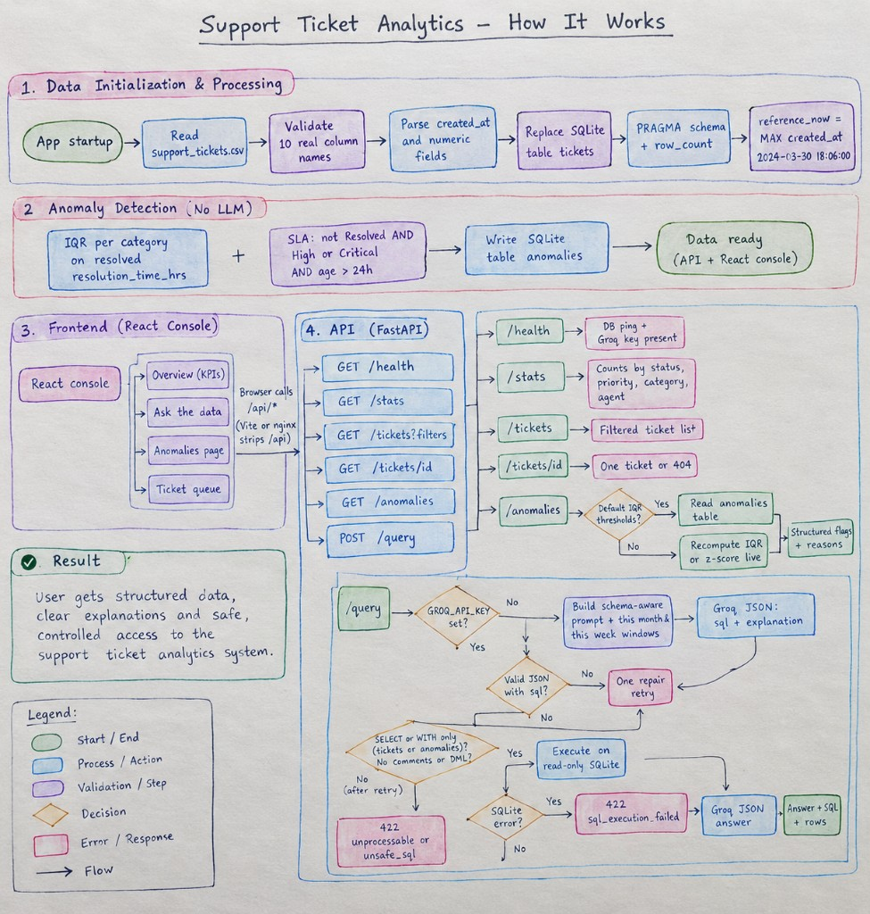

# Support Ticket Intelligence System

**DOTMappers AI Engineer assessment** — ingest a support-ticket CSV, answer natural-language questions, flag anomalies, and serve both a REST API and an operations console.

The LLM is a **translation layer, not a compute engine**. Groq turns a question into SQLite and turns result rows back into prose. Counts, averages, filters, and anomaly scores are computed in deterministic Python so numbers cannot hallucinate.

| Layer | What it is | What it is not |
| --- | --- | --- |
| Groq (`openai/gpt-oss-20b`) | Text-to-SQL + a short explanation of the rows | The source of counts, averages, or anomaly flags |
| SQLite | Source of truth after ingest | A write surface for the query path |
| FastAPI | REST contract + startup orchestration | A place that re-implements UI logic |
| Streamlit (`ui/`) | Python UI named in the brief | A second copy of the business rules |
| React console | Optional extra HTTP client over `/api/*` | Not required for the Python-only path |

---

## Table of contents

1. [Quick start](#quick-start)
2. [How it works](#how-it-works)
3. [Why the system is shaped this way](#why-the-system-is-shaped-this-way)
4. [Models and tools](#models-and-tools)
5. [REST API](#rest-api)
6. [Example queries and verified outputs](#example-queries-and-verified-outputs)
7. [Operations console](#operations-console)
8. [Configuration](#configuration)
9. [Project layout](#project-layout)
10. [Tests](#tests)
11. [Known limitations](#known-limitations)
12. [Walkthrough talking points](#walkthrough-talking-points)

---

## Quick start

A Groq key from [console.groq.com](https://console.groq.com) is required only for `POST /query`. Health, stats, tickets, and anomalies run without it.

### Docker — one command

```bash
copy .env.example .env
# add GROQ_API_KEY=... to .env
docker compose up --build
```

| Surface | URL |
| --- | --- |
| Streamlit (Python UI) | http://127.0.0.1:8501 |
| React console (optional extra) | http://127.0.0.1:5173 |
| OpenAPI docs | http://127.0.0.1:8000/docs |
| Health | http://127.0.0.1:8000/health |

Compose reads `GROQ_API_KEY` from a local `.env` if present. The stack still starts without a key; natural-language query returns HTTP 503 with a structured error.

### Local — Python only (what the brief names)

From a clean folder this is **four commands**, then one process:

```bash
python -m venv .venv
.venv\Scripts\activate
pip install -r requirements.txt
copy .env.example .env
```

Add `GROQ_API_KEY` to `.env`, then pick one:

```bash
streamlit run ui/streamlit_app.py
```

http://127.0.0.1:8501 — Overview, Ask, Anomalies, Ticket queue. Same `TicketService` as FastAPI.

```bash
uvicorn app.main:app --reload --host 127.0.0.1 --port 8000
```

http://127.0.0.1:8000/docs — REST API.

The brief’s **single command** is Docker above. Local setup is not one command unless the venv already exists; then it is one (`streamlit run` or `uvicorn`).

Optional React console (not required for the Python-only clause):

```bash
cd web
npm ci
npm run dev
```

```bash
python -m pytest tests -q
```

---

## How it works

End-to-end flow: CSV ingest and schema introspection, statistical anomaly detection with no LLM, FastAPI surfaces, the Streamlit Python UI (React is optional), and the guarded text-to-SQL path.



**Reading the diagram**

1. **Data initialization** — on startup the CSV is validated against the ten real column names, dates and numbers are coerced, `tickets` is replaced in SQLite, schema is introspected with `PRAGMA`, and `reference_now` is set to `MAX(created_at)` = `2024-03-30 18:06:00`.
2. **Anomaly detection (no LLM)** — IQR per category on resolved `resolution_time_hrs`, plus SLA breaches (unresolved High/Critical older than 24h). Results are written to an `anomalies` table so the API and console can read them.
3. **UIs** — Streamlit is the Python console (`ui/streamlit_app.py`). The React console is optional and only calls `/api/*`.
4. **FastAPI** — `/health`, `/stats`, `/tickets`, `/tickets/{id}`, `/anomalies` (cached IQR or live IQR/z-score), and `POST /query`.
5. **Query path** — if a Groq key is missing, 503. Otherwise Groq returns JSON `{sql, explanation}`, the guard allows only `SELECT`/`WITH` on `tickets`/`anomalies`, SQLite runs read-only, and Groq writes the answer from the rows. Unsafe or unexecutable SQL is 422, never silent.

---

## Why the system is shaped this way

These are dataset facts, not generic best-practice slides.

| Constraint in the brief / file | What the system does |
| --- | --- |
| The PDF schema preview uses aliases (`resol_time_hrs`, `cust_rating`) | Runtime introspection from the loaded CSV/SQLite. Prompts follow the file, not the PDF. Real names: `resolution_time_hrs`, `customer_rating`. |
| Dates are Q1 2024 (`2024-01-01 08:54` → `2024-03-30 18:06`) | “This month” / “this week” / “currently open” are bound to `reference_now = MAX(created_at)`. A wall-clock date in 2026 would return zero rows. |
| Resolution time is right-skewed (median 12h, max 119.7h) | Default detector is Tukey IQR (`k = 1.5`) per category. Z-score is available as `?method=zscore` for comparison. |
| 173 unresolved tickets have null `resolution_time_hrs` and `customer_rating` | Those nulls are domain-meaningful (1:1 with Open/Escalated). They are never imputed. IQR only scores **resolved** tickets. |
| “Currently open” vs “unresolved” | Open = `status = 'Open'` (**111**). Unresolved = Open + Escalated (**173**). The prompt states this so Groq does not merge the two. |

CSV column contract (validated at ingest — extra columns are ignored, missing required columns fail startup):

`ticket_id`, `created_at`, `category`, `priority`, `status`, `response_time_hrs`, `resolution_time_hrs`, `agent_id`, `customer_rating`, `issue_summary`

---

## Models and tools

| Piece | Choice | Why |
| --- | --- | --- |
| LLM | Groq `openai/gpt-oss-20b` (JSON mode) | Free-tier, fast, structured `{sql, explanation}` then `{answer}`. Model ID is configurable — some Groq accounts do not list Llama 3.3. |
| Compute | SQLite + pandas | Deterministic aggregates. The model never “adds up” tickets. |
| SQL safety | `sqlparse` + table allow-list + comment ban + DML ban | Defense in depth with a **read-only** SQLite URI on the query path. |
| Anomalies | IQR (default) + 24h High/Critical SLA | No LLM in the detector. Reproducible without an API key. |
| API | FastAPI + Pydantic v2 | Typed request/response, OpenAPI at `/docs`, JSON errors. |
| UI | React 19 + Vite + TypeScript | Light operations console. Business logic stays on the API. |
| Config | `pydantic-settings` + `.env` | Thresholds are not hidden constants. |
| Tests | pytest | Ingest, IQR/SLA, SQL guard, health/stats/anomalies. |
| Run | `docker compose up --build` | API + nginx-served console, `/api` reverse-proxied. |

The Groq client uses JSON-mode responses, a timeout, and a bounded retry. The text-to-SQL path gets **one repair retry** if the first JSON is missing `sql` or the guard rejects the statement.

---

## REST API

| Method | Path | Auth / LLM | Purpose |
| --- | --- | --- | --- |
| `GET` | `/health` | none | DB ping, row count, `reference_now`, whether a Groq key is present. No model call. |
| `GET` | `/metrics` | none | Process counters: request volume, errors, LLM/SQL latency averages. |
| `GET` | `/stats` | none | Counts by status, priority, category, agent + numeric summaries + anomaly counts. |
| `GET` | `/tickets` | none | Filterable queue: `status`, `priority`, `category`, `agent_id`, `search`, `limit`, `offset`. |
| `GET` | `/tickets/{id}` | none | One ticket or 404. |
| `GET` | `/anomalies` | none | `method=iqr\|zscore`, `anomaly_type=all\|resolution_outlier\|sla_breach`. Default IQR is the table written at startup. |
| `POST` | `/query` | Groq | Body `{"question": "..."}` → `answer`, `sql`, `explanation`, `row_count`, capped `rows`. |

Errors are always JSON `{"error": "...", "detail": "..."}`:

| Status | When |
| --- | --- |
| `400` | Invalid request (empty question, bad query params) |
| `401` | `API_TOKEN` is set and the bearer token is missing or wrong |
| `404` | Unknown `ticket_id` |
| `422` | Unsafe SQL (not SELECT/WITH, wrong tables, comments, DML) or SQLite execution failure |
| `503` | Groq key missing, model unavailable, or upstream timeout |
| `504` | Generated SQL exceeded `SQL_TIMEOUT_SECONDS` |

Interactive contract: http://127.0.0.1:8000/docs

---

## Example queries and verified outputs

All numbers below are from **this** `data/support_tickets.csv` (500 rows). Relative dates use `reference_now = 2024-03-30 18:06:00`.

### Deterministic endpoints (no Groq)

`GET /health`

```json
{
  "status": "ok",
  "database": "connected",
  "groq_configured": true,
  "row_count": 500,
  "reference_now": "2024-03-30 18:06:00"
}
```

`GET /stats` (excerpt)

```json
{
  "row_count": 500,
  "by_status": { "Resolved": 327, "Open": 111, "Escalated": 62 },
  "anomaly_counts": { "resolution_outlier": 22, "sla_breach": 80 },
  "resolution_time_hrs": { "count": 327, "mean": 19.158, "median": 12.0, "max": 119.7 }
}
```

`GET /anomalies?anomaly_type=sla_breach` returns **80** High/Critical tickets still Open or Escalated and older than 24 hours versus `2024-03-30 18:06:00`.

`GET /anomalies?anomaly_type=resolution_outlier` returns **22** IQR outliers on resolved resolution time.

### Natural-language questions (`POST /query`)

The SQL is what the guard executed. Groq writes the prose around these numbers when a key is set. Generated SQL is always returned so a wrong translation is visible.

**1. “How many tickets are currently open?”**

```sql
SELECT COUNT(*) AS open_tickets FROM tickets WHERE status = 'Open'
```

Answer: **111** (not 173 — Escalated is unresolved, not open).

**2. “Which agent resolved the most tickets this month?”**

```sql
SELECT agent_id, COUNT(*) AS resolved_count
FROM tickets
WHERE status = 'Resolved' AND strftime('%Y-%m', created_at) = '2024-03'
GROUP BY agent_id
ORDER BY resolved_count DESC
LIMIT 1
```

Answer: **AGT-01** with **16** resolved tickets in March 2024.

**3. “Show me all Critical tickets not resolved within 12 hours.”**

```sql
SELECT ticket_id, status, resolution_time_hrs,
       (julianday('2024-03-30 18:06:00') - julianday(created_at)) * 24.0 AS age_hours
FROM tickets
WHERE priority = 'Critical'
  AND (
        (status = 'Resolved' AND resolution_time_hrs > 12)
     OR (status IN ('Open', 'Escalated')
         AND (julianday('2024-03-30 18:06:00') - julianday(created_at)) * 24.0 > 12)
  )
```

Answer: **34** tickets.

**4. “What is the average customer rating for Technical category tickets?”**

```sql
SELECT AVG(customer_rating) AS avg_rating
FROM tickets
WHERE category = 'Technical'
```

Answer: **3.74** across **104** rated (resolved) Technical tickets. Unresolved Technical tickets are excluded because rating is NULL.

**5. “Are there any anomalies in resolution times this week?”**

```sql
SELECT ticket_id, metric_value, created_at, reason
FROM anomalies
WHERE anomaly_type = 'resolution_outlier'
  AND created_at >= '2024-03-23 18:06:00'
  AND created_at <= '2024-03-30 18:06:00'
ORDER BY metric_value DESC
```

Answer: **yes — 6** IQR outliers in that week, including **TKT-108** (119.7h) and **TKT-130** (114.3h).

Adversarial / extra questions used in `tests/test_nl_evaluation.py` (same `reference_now`):

| Question | Expected semantic behavior |
| --- | --- |
| How many unresolved critical tickets are there? | Critical + Open/Escalated → **31** |
| Show high-priority tickets older than 24 hours. | Unresolved High/Critical age > 24h → **80** (same set as SLA) |
| Which agent has the lowest customer rating? | **AGT-08** (avg **3.48** over 25 rated tickets) |
| Show unresolved Technical tickets. | Technical + Open/Escalated → **48** |
| What percentage of tickets are escalated? | 62 / 500 → **12.4%** |
| What is the average resolution time for Critical tickets? | AVG of non-null Critical resolution times → **10.629h** |
| How many Billing tickets were resolved in the dataset's latest month? | Billing + Resolved + March 2024 → **34** |

Typical `/query` envelope:

```json
{
  "question": "How many tickets are currently open?",
  "answer": "There are 111 currently open tickets.",
  "sql": "SELECT COUNT(*) AS open_tickets FROM tickets WHERE status = 'Open'",
  "explanation": "Count rows whose status is Open only.",
  "row_count": 1,
  "rows": [{ "open_tickets": 111 }]
}
```

---

## Operations console

**Streamlit** (`ui/streamlit_app.py`) is the Python UI the brief lists (Streamlit / Gradio). It calls `TicketService` in-process: Overview, Ask, Anomalies, Ticket queue.

**React** is an optional extra console. Every React page is an HTTP client; no analytics are recomputed in the browser.

| Page | Route | What you can do |
| --- | --- | --- |
| Overview | `/` | KPIs from `/stats` and `/health` — volume, open vs resolved, IQR/SLA counts, `reference_now`. |
| Ask the data | `/ask` | Type a question, see answer, generated SQL, explanation, and result rows. |
| Anomalies | `/anomalies` | Filter IQR vs z-score and outlier vs SLA. Read reasons written by the detector. |
| Ticket queue | `/tickets` | Filter by status / priority / category / search. Open a ticket drawer from `/tickets/{id}`. |

---

## Configuration

Nothing about the 500-row file is hardcoded into prompts as sample answers. Thresholds live in `.env` / `app/config.py`.

| Variable | Default | Role |
| --- | --- | --- |
| `GROQ_API_KEY` | empty | Required for `/query` |
| `GROQ_MODEL` | `openai/gpt-oss-20b` | Must be a model your Groq key can list |
| `CSV_PATH` | `data/support_tickets.csv` | Ingest source |
| `DB_PATH` | `data/tickets.db` | Local SQLite (gitignored) |
| `IQR_MULTIPLIER` | `1.5` | Tukey fence |
| `ZSCORE_THRESHOLD` | `3.0` | `/anomalies?method=zscore` |
| `SLA_BREACH_HOURS` | `24` | Unresolved High/Critical age |
| `IQR_GROUP_BY_CATEGORY` | `true` | Per-category IQR fences. `false` uses one fence over all resolved tickets |
| `QUERY_RESULT_ROW_CAP` | `50` | SQLite returns at most cap+1 rows; the 51st row only marks truncation |
| `SQL_TIMEOUT_SECONDS` | `3` | Cancels a generated SELECT if the SQLite VM runs too long |
| `SQL_MAX_JOINS` | `2` | Query-complexity cap in the SQL guard |
| `API_TOKEN` | empty | Optional bearer auth for every non-public route. `/health`, `/metrics`, and OpenAPI stay public |
| `VITE_API_TOKEN` | empty | Browser-visible demo token for the React console. Not a production secret |
| `VITE_API_BASE_URL` | `/api` | Browser API prefix (Vite/nginx rewrite) |
| `CORS_ORIGINS` | local Vite/preview | Comma-separated browser origins |

Do not commit `.env`. `.env.example` is the template. If you set `API_TOKEN`, set `VITE_API_TOKEN` to the same value for the React console (Compose does this when `VITE_API_TOKEN` is unset). `VITE_*` values are compiled into the browser bundle, so this is optional demo protection, not secret management.

---

## Project layout

```
app/
  main.py                 FastAPI app, request IDs, optional auth, error JSON
  config.py               pydantic-settings
  observability.py        process metrics
  ingestion/              CSV → SQLite, required columns, timed read-only connect
  nlquery/                prompts, text-to-SQL, sqlparse guard, eval cases
  anomalies/              IQR + SLA detector (no LLM)
  services/               SQL-backed stats/queue + guarded query path
  llm/                    Groq client (JSON mode, timeout, retries, latency)
  models/                 Pydantic response contracts
ui/                       Streamlit Python UI (same TicketService)
web/                      optional React + Vite console
  nginx.conf              /api reverse-proxy + timeouts for Docker
tests/                    ingest, detector, SQL guard, NL eval, LLM failures, limits
data/support_tickets.csv  assessment dataset (500 rows)
docs/architecture-flowchart.jpg
docker-compose.yml
Dockerfile
```

---

## Tests

```bash
python -m pytest tests -q
```

Last local run of that command: **44 passed**.

| File | What it locks in |
| --- | --- |
| `tests/test_ingestion.py` | Real column names load; missing columns fail |
| `tests/test_anomaly_detector.py` | Extreme resolution time is an IQR outlier; SLA is High/Critical + age; `IQR_GROUP_BY_CATEGORY` true vs false changes the outlier set |
| `tests/test_sql_guard.py` | SELECT/WITH on allow-listed tables pass; comments, DML, catalogs, recursive CTEs, and extra JOINs fail |
| `tests/test_nl_evaluation.py` | Golden questions: intended SQL semantics and verified numeric results, including NULLs |
| `tests/test_date_windows.py` | this/last week and this/last month bind to `2024-03-30 18:06:00` |
| `tests/test_llm_failures.py` | Invalid JSON, missing `sql`, DML, timeout fallback |
| `tests/test_query_limits.py` | Row cap, bounded `fetchmany` (no `fetchall`), SELECT and COUNT(*) timeouts, `/metrics` |
| `tests/test_auth.py` | Optional bearer token; `/health` remains public |
| `tests/test_api_integration.py` | `/health`, `/stats`, `/anomalies` after ingest; `/query` is structured 200 or honest 503 |

---

## Known limitations

- **Text-to-SQL is probabilistic.** Unusual wording can still miss. The one-retry repair helps; generated SQL is always returned so a wrong query is inspectable. `tests/test_nl_evaluation.py` locks the *intended* SQL and the numeric result; it does not prove every live Groq wording.
- **The SQL guard is a read-only safety layer for this prototype**, not a complete sandbox. It allow-lists tables, blocks DML/comments/multiple statements, caps JOINs, and executes on a read-only URI with a VM timeout. Do not describe it as “SQL-injection-proof.”
- **IQR and the 24h SLA are statistical defaults**, not DOTMappers’ real policy. They are config, not hidden constants.
- **500-row SQLite + pandas at ingest is appropriate for this file.** Stats and ticket listing are SQL. A production warehouse (Postgres, pagination, no full-table pandas) would be required for hundreds of thousands of tickets.
- **Groq free-tier rate limits are not queued.** Under burst load, `/query` would need a worker.
- **Auth is optional demo protection.** `API_TOKEN` gates non-public API routes. `VITE_API_TOKEN` is baked into the React build and can be read from the browser. There is no multi-tenancy or per-user isolation.
- **Anomaly explanations are rule strings**, not LLM write-ups. Detection never depends on Groq.
- **Row cap is 50.** Generated SELECTs are wrapped with `LIMIT cap+1` and read with `fetchmany`. The exact match count uses `COUNT(*)` of the original SELECT so Python never holds the full result set.

---

## Walkthrough

1. The LLM translates; SQLite and statistics compute. That is why “currently open” is **111**, not a guessed paragraph.
2. Schema is introspected. The PDF column aliases were wrong; the system follows the CSV.
3. “Now” is `MAX(created_at)` because the file is Q1 2024. Relative phrases would be empty against a 2026 clock.
4. SQL guard + a read-only SQLite URI + a VM timeout is defense in depth. It is not a full production sandbox.
5. **80** SLA breaches and **22** IQR outliers are reproducible with no API key.
6. The console is a client. If a number on Overview disagrees with `/stats`, that is a bug in the UI, not a second algorithm.
7. Aggregations for `/stats` and `/tickets` run in SQL. Pandas is used at ingest and for IQR because the file is 500 rows.
8. `GET /metrics` and `X-Request-ID` exist so a walkthrough can show latency and error counts without a third-party APM.
9. With more time: Ollama fallback, a query cache, a Groq queue, and a real warehouse.

---

## Submission

Repository: https://github.com/Surya8663/Support-Ticket-Intelligence-System
